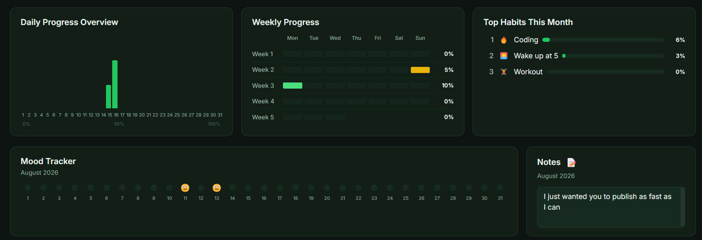

# Habiter


A private, offline habit tracker for your desktop. Track daily habits, build streaks, log your mood and sleep, and see your full month at a glance — with zero accounts, zero cloud, and zero data ever leaving your machine.



---

## Features

- **Daily habit tracker grid** — see every habit as a row and every day of the month as a column. Mark each day as **Completed**, **Partially Done**, **Not Done**, or **Skipped** with a single click.
- **Streaks** — current streak and best streak tracked automatically, per habit and overall.
- **Stats dashboard** — completed/remaining counts, current & best streak, and total habits tracked, all at a glance.
- **Daily Progress Overview** — a bar chart showing your completion rate for every day of the month.
- **Weekly Progress** — a week-by-week breakdown (Mon–Sun) so you can spot patterns in when you're most consistent.
- **Top Habits This Month** — a ranked list of your best-performing habits by completion rate.
- **Mood tracker** — log a daily mood and see the whole month laid out as a simple emoji strip.
- **Notes** — a free-text space for a monthly note or reminder to yourself.
- **Reminders** — native desktop notifications so you never forget to check in.
- **Data export & import** — export your data anytime as **JSON** or **CSV**, and import it back to restore.
- **Simple by design** — no categories, no clutter, no gamified social features. Just your habits and your consistency.

## Why Habiter

- **Fully offline.** Habiter runs entirely on your machine. No account, no sign-up, no internet connection required.
- **Zero telemetry.** No analytics, no tracking, no crash reporting phoning home. Nothing about your usage is ever sent anywhere.
- **Your data stays yours.** Everything is stored in a local database file on your computer. Export it, back it up, or delete it — it's entirely under your control.

## Download

Grab the latest installer for your operating system from the [Releases page](https://github.com/aradhyapratapconnect-cell/Habiter/releases/latest):

| OS | File |
|---|---|
| Windows | `Habiter-1.0.1-setup.exe` |
| macOS | `Habiter-1.0.1.dmg` |
| Linux | `Habiter-1.0.1.AppImage` or `.deb` |

### A note on installation warnings

Habiter isn't code-signed yet, so your operating system may show a security warning on first install. This is expected for a small open-source app without a paid certificate — it does **not** mean the app is unsafe.

- **Windows:** click **"More info"** on the SmartScreen popup, then **"Run anyway."**
- **macOS:** if Gatekeeper blocks the app, right-click the app in Finder and choose **"Open,"** then confirm **"Open"** in the dialog that appears.
- **Linux (.AppImage):** you may need to mark the file as executable first: `chmod +x Habiter-*.AppImage`

macOS and Linux builds compile successfully but haven't been manually tested on real hardware — please open an issue if you hit problems."

## Building from Source

```bash
git clone https://github.com/aradhyapratapconnect-cell/Habiter.git
cd Habiter
npm install
npm run dev
```

To produce a local installer for your current OS without publishing it:

```bash
npx electron-builder --publish never
```

## Tech Stack

- **Electron** — cross-platform desktop app shell
- **React + TypeScript** — UI
- **SQLite** — local data storage
- **Tailwind CSS** — styling
- **Recharts** — dashboard charts
- **electron-builder** — packaging and releases

## Data & Privacy

All of your data — habits, check-ins, mood, sleep, and notes — lives in a local database file on your own computer, stored in the standard app-data directory for your OS. Habiter makes no network calls of any kind during normal use. You can export your full data at any time as JSON or CSV from the Daily Habit Tracker screen, and import it back to restore or transfer it to another machine yourself.

## Contributing

Issues and pull requests are welcome. If you run into a bug or have a feature idea, please open an [issue](https://github.com/aradhyapratapconnect-cell/Habiter/issues).

## License

Habiter is licensed under the [MIT License](LICENSE) — free to use, modify, and distribute, with attribution.
